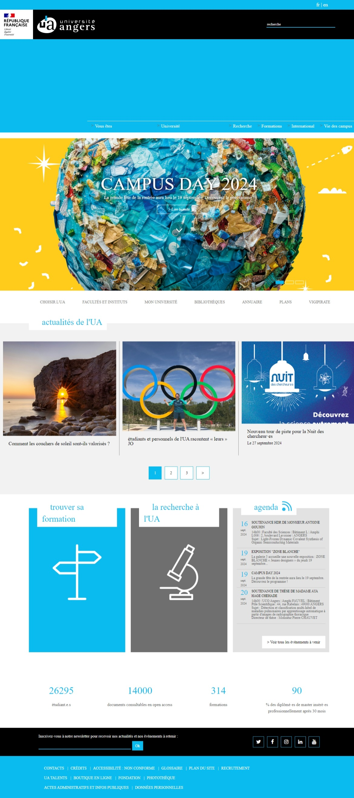

# Universite angers fork

## Technical information
**Language**: Python   
**Framework**: Django   

## Description
This project is a fork of <a href="https://www.univ-angers.fr/fr/index.html">the University of Angers</a> website.

## Demo
Here is a demo of the site to give you an overview of its features and user interface.

You can access the complete gallery by navigating to the directory _screenshots_.

© 2024